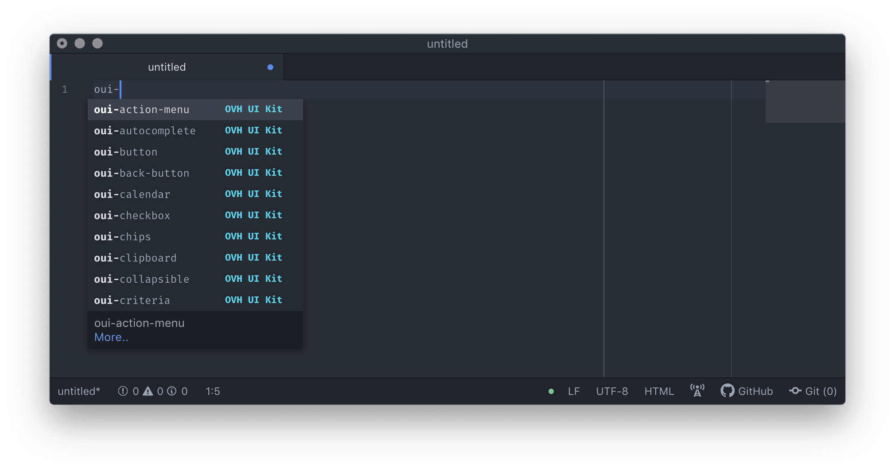

:warning: Following extension is deprecated. See [Sunsetting Atom](https://github.blog/2022-06-08-sunsetting-atom/) blog post.

# OVHcloud UI Kit Snippets for [Atom](https://atom.io)

> Collection of OVHcloud UI Kit snippets for Atom.

[](https://ovh.github.io/ovh-ui-kit/)

**Disclaimer**: OVHcloud UI Kit Snippets for Atom it is not an official OVHcloud product.

## Install

```sh
$ apm install atom-ovh-ui-kit-snippets
```

## Usage


## Related

* [ovh-ui-kit](https://github.com/ovh/ovh-ui-kit) - OVHcloud UI Kit - Master UI Framework
* [sublime-ovh-ui-kit-snippets](https://github.com/antleblanc/sublime-ovh-ui-kit-snippets) - Collection of OVHcloud UI Kit snippets for Sublime Text
* [vscode-ovh-ui-kit-snippets](https://github.com/antleblanc/vscode-ovh-ui-kit-snippets) - Collection of OVHcloud UI Kit snippets for Visual Studio Code

## License

MIT © [Antoine Leblanc](https://antleblanc.me)
